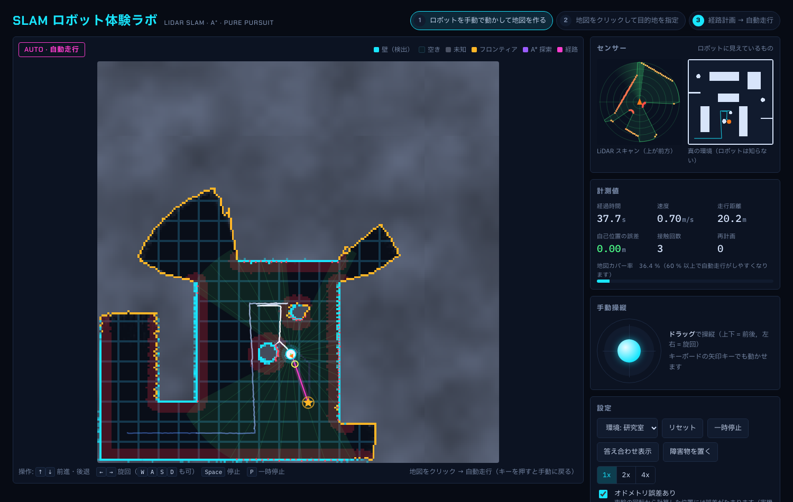

# 自律移動ロボット シミュレータ（SLAM・A*・Pure Pursuit）

自律移動ロボットの基本的なしくみを、見て・触って理解するための教材用シミュレータです。

- **SLAM**：LiDAR で周りを測り、地図を作りながら自分の位置を推定する
- **A\***：作った地図の上で、ゴールまでの最短経路を探す
- **Pure Pursuit**：経路の少し先の点を追いかけて、速度と旋回の速さを決める

ブラウザで動く**体験版（HTML）**と、自動で動く様子を観察する **MATLAB 版**の 2 種類があります。



---


---

### 起動方法

`slam_robot_lab.html` をブラウザ（Chrome / Edge / Safari / Firefox）で開くだけです。インストールは要りません。インターネットに接続していなくても動きます（その場合、フォントだけが標準フォントになります）。

GitHub Pages を有効にすると、URL を共有するだけで学生がスマートフォンやタブレットからも使えます（Settings → Pages → Branch に `main` / `/ (root)` を指定）。

```
https://<ユーザー名>.github.io/<リポジトリ名>/
```

`slam_robot_lab.html` を編集したときは、`index.html` にも同じ内容をコピーしてください。

### 遊び方

1. **手動で地図を作る**
   矢印キー（または WASD）か、画面のジョイスティックでロボットを動かします。LiDAR が届いた場所から霧が晴れ、壁がシアン色で描かれていきます。
2. **目的地を指定する**
   地図上の「空き」の場所をクリックします。地図カバー率が 60 % を超えると、遠くまで自動走行しやすくなります。
3. **自動走行を見る**
   A\* が探索したセルが紫色に広がり、経路（マゼンタ）が引かれたあと、ロボットが自動で走ります。キーを押すといつでも手動に戻ります。

### 操作

| 操作 | キー / ボタン |
|---|---|
| 前進・後退 | `↑` `↓`（`W` `S`） |
| 旋回 | `←` `→`（`A` `D`） |
| 停止 | `Space` |
| 一時停止 | `P` または「一時停止」ボタン |
| 目的地を指定 | 地図をクリック |
| 障害物を置く | 「障害物を置く」を押してから地図をクリック |

### 授業で試してほしいこと

- **スキャンマッチングをオフにして走る**
  車輪の回転から計算した位置には誤差がたまります。補正をオフにすると「自己位置の誤差」が増えていき、地図の壁が二重になったり曲がったりします。オンに戻すと、LiDAR の形を地図に重ね合わせて位置が補正されることが分かります。
- **「答え合わせ表示」を押す**
  真の壁（赤）と本当の位置（赤い点線）が重なり、作った地図がどれくらい正しいかを確かめられます。
- **自動走行中に障害物を置く**
  ロボットは置かれた障害物をまだ知りません。LiDAR で見つけた瞬間に経路を引き直します。
- **環境を切り替える**
  研究室・倉庫・迷路の 3 種類があります。


## しくみ

| 処理 | 方法 |
|---|---|
| LiDAR | 360° 方向にビームを飛ばし、壁までの距離を測る（距離に小さなノイズを加える） |
| 地図 | 占有格子地図（0.1 m 四方のセル）。ビームが通過したセルは「空き」、当たったセルは「壁」の確率を log-odds で更新する |
| 自己位置推定（HTML 版） | オドメトリで予測した位置のまわりを探索し、スキャンの反射点が地図の壁に最もよく重なる位置を選ぶ（相関型スキャンマッチング） |
| 経路計画 | 壁をロボット半径＋余裕分だけ膨らませた地図で 8 近傍 A\* を行い、視線が通る点までショートカットして経路をなめらかにする |
| 経路追従 | Pure Pursuit。先読み点への角度から角速度を決め、向きが大きくずれているときはその場で旋回する |
| ロボット | 差動二輪（並進速度 v と角速度 ω で動く） |

主なパラメータは、HTML 版では  `const P = {...}`にまとめてあります。LiDAR の到達距離、ロボットの速度、安全マージンなどを変えて挙動の違いを比べられます。
